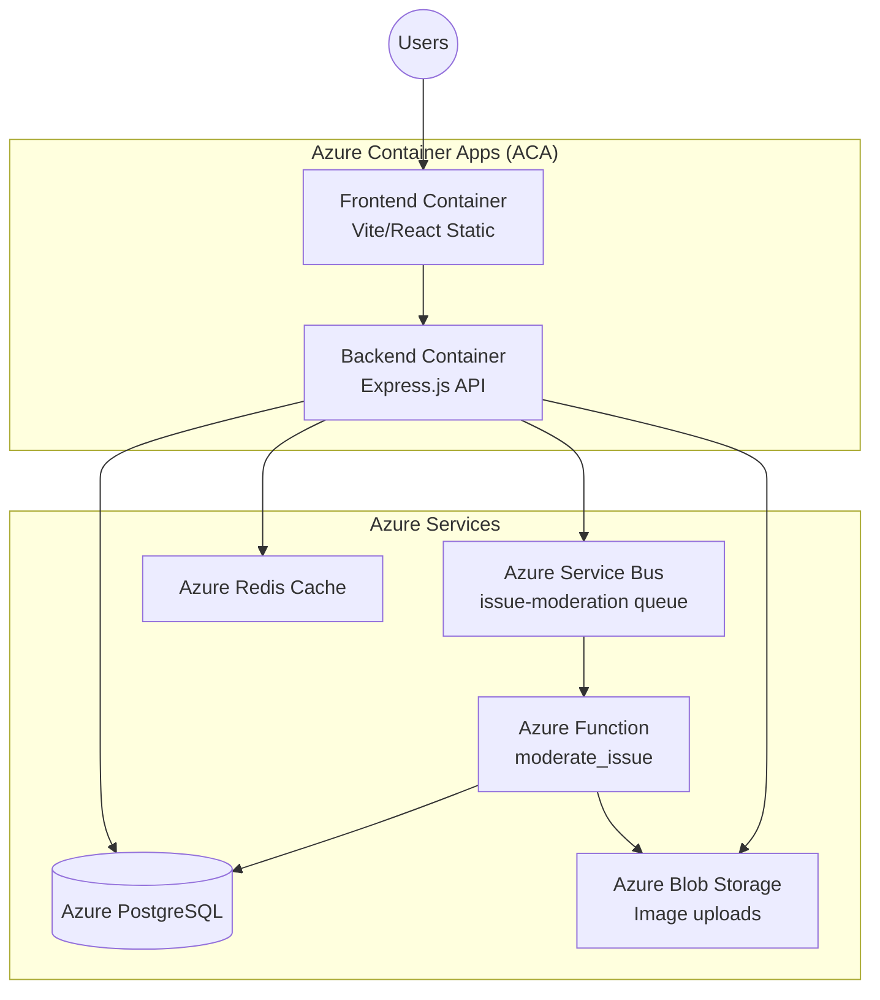

# Azure Cloud Integration Analysis

This document outlines all changes required to deploy the Public Issues Tracker application to **Azure Container Apps (ACA)** with **Azure Service Bus**, **Azure Redis Cache**, and **PostgreSQL** (already hosted).

---

## Architecture Overview



---

## 1. Service Bus Integration for Issue Moderation

### Current State
- **Queue Service**: [QueueService.ts](file:///c:/Github/dpcs_2/project-2-segfault2/segfault-backend/src/services/QueueService.ts) uses **Azure Storage Queue** (not Service Bus)
- **Azure Function**: [function_app.py](file:///c:/Github/dpcs_2/project-2-segfault2/segfault-moderation/function_app.py) uses `@app.queue_trigger` for Storage Queue
- **Issue Creation**: [issue.ts](file:///c:/Github/dpcs_2/project-2-segfault2/segfault-backend/src/data/issue.ts) - Lines 24-26 and 54-56 currently set `authorized: IssueAuthorized.TRUE` (dev mode override)

### Required Changes

#### [MODIFY] [QueueService.ts](file:///c:/Github/dpcs_2/project-2-segfault2/segfault-backend/src/services/QueueService.ts)
Replace Azure Storage Queue with Azure Service Bus:

```diff
- import { QueueClient } from "@azure/storage-queue";
+ import { ServiceBusClient, ServiceBusSender } from "@azure/service-bus";

- const connectionString = process.env.AZURE_STORAGE_CONNECTION_STRING || "";
- const queueName = "issue-moderation";
+ const connectionString = process.env.AZURE_SERVICE_BUS_CONNECTION_STRING || "";
+ const queueName = "issue-moderation";

- let queueClient: QueueClient | null = null;
+ let serviceBusClient: ServiceBusClient | null = null;
+ let sender: ServiceBusSender | null = null;

- function getQueueClient(): QueueClient | null {
+ function getSender(): ServiceBusSender | null {
      if (!connectionString) {
-         console.warn("Azure Storage connection string not configured.");
+         console.warn("Azure Service Bus connection string not configured.");
          return null;
      }
-     if (!queueClient) {
-         queueClient = new QueueClient(connectionString, queueName);
+     if (!serviceBusClient) {
+         serviceBusClient = new ServiceBusClient(connectionString);
+         sender = serviceBusClient.createSender(queueName);
      }
-     return queueClient;
+     return sender;
  }

  export async function sendToModerationQueue(task: ModerationTask): Promise<boolean> {
-     const client = getQueueClient();
+     const sender = getSender();
-     if (!client) {
+     if (!sender) {
          console.log("Moderation queue not available, skipping...");
          return false;
      }

      try {
-         const message = Buffer.from(JSON.stringify(task)).toString("base64");
-         await client.sendMessage(message);
+         await sender.sendMessages({
+             body: task,
+             contentType: "application/json"
+         });
          console.log(`Sent issue ${task.issueId} to moderation queue`);
          return true;
      } catch (error) {
          console.error("Failed to send to moderation queue:", error);
          return false;
      }
  }
```

**New dependency**: `@azure/service-bus`

---

#### [MODIFY] [issue.ts](file:///c:/Github/dpcs_2/project-2-segfault2/segfault-backend/src/data/issue.ts)
Change issue creation to set `authorized: FALSE` by default:

```diff
// Line 24-26 in createAuthenticatedIssue()
- // Dev mode: set all issues as valid/authorized by default
- authorized: IssueAuthorized.TRUE,
- error: IssueError.NONE,
+ // Production: issues require moderation before becoming visible
+ authorized: IssueAuthorized.FALSE,
+ error: IssueError.PENDING,

// Line 54-56 in createGuestIssue()
- // Dev mode: set all issues as valid/authorized by default
- authorized: IssueAuthorized.TRUE,
- error: IssueError.NONE,
+ // Production: issues require moderation before becoming visible
+ authorized: IssueAuthorized.FALSE,
+ error: IssueError.PENDING,
```

---

#### [MODIFY] [function_app.py](file:///c:/Github/dpcs_2/project-2-segfault2/segfault-moderation/function_app.py)
Update Azure Function trigger from Storage Queue to Service Bus:

```diff
- @app.queue_trigger(arg_name="msg", queue_name="issue-moderation", connection="AzureWebJobsStorage")
- def moderate_issue(msg: func.QueueMessage):
+ @app.service_bus_queue_trigger(arg_name="msg", queue_name="issue-moderation", connection="ServiceBusConnection")
+ def moderate_issue(msg: func.ServiceBusMessage):
      try:
-         data = json.loads(msg.get_body().decode("utf-8"))
+         data = json.loads(msg.get_body().decode("utf-8"))
          # ... rest remains the same
```

**New config required** in `local.settings.json`:
```json
{
    "Values": {
        "ServiceBusConnection": "<your-service-bus-connection-string>"
    }
}
```

---

## 2. Azure Redis Cache Integration

### Current State
- **Redis Client**: [redisClient.ts](file:///c:/Github/dpcs_2/project-2-segfault2/segfault-backend/src/data/redisClient.ts) - **IN-MEMORY FAKE IMPLEMENTATION**
- Currently caching:
  - Issue summaries by geo-grid cells (`issues:grid:{lat}:{lng}`)
  - Individual issue summaries (`issue:summary:{id}`)

### Required Changes

#### [MODIFY] [redisClient.ts](file:///c:/Github/dpcs_2/project-2-segfault2/segfault-backend/src/data/redisClient.ts)
Replace FakeRedisClient with actual Redis client:

```typescript
import { createClient, RedisClientType } from "redis";

const redisUrl = process.env.AZURE_REDIS_CONNECTION_STRING || "redis://localhost:6379";

let client: RedisClientType | null = null;

async function getClient(): Promise<RedisClientType> {
    if (!client) {
        client = createClient({
            url: redisUrl,
            socket: {
                tls: redisUrl.includes("redis.cache.windows.net"),
                rejectUnauthorized: false
            }
        });
        
        client.on("error", (err) => console.error("Redis Client Error:", err));
        await client.connect();
    }
    return client;
}

// Wrapper functions to match existing API
export const redisClient = {
    async get(key: string): Promise<string | null> {
        const c = await getClient();
        return c.get(key);
    },
    async setex(key: string, seconds: number, value: string): Promise<"OK"> {
        const c = await getClient();
        await c.setEx(key, seconds, value);
        return "OK";
    },
    async del(...keys: string[]): Promise<number> {
        const c = await getClient();
        return keys.length > 0 ? await c.del(keys) : 0;
    },
    async keys(pattern: string): Promise<string[]> {
        const c = await getClient();
        return c.keys(pattern);
    },
    // ... add other methods as needed
};

export default redisClient;
```

**New dependency**: `redis` (npm package)

---

### Additional Caching Opportunities

| Data | Current State | Recommendation | TTL |
|------|--------------|----------------|-----|
| **Issue Summaries** | ✅ Already cached in `IssueCacheService` | Keep as-is | 5-10 min |
| **Issue Types** | Hardcoded in `issueController.ts` | Cache static data | 1 hour |
| **Graph Nodes/Edges** | Loaded from DB on EVERY pathfinding request | **HIGH PRIORITY** - Cache the entire graph | 30-60 min |
| **User Sessions/Tokens** | JWT only, no caching | Consider session caching | Token TTL |
| **Analytics Aggregations** | Computed on every request | Cache dashboard stats | 5 min |
| **Notifications Count** | DB query per user | Cache per-user counts | 1 min |

#### High Priority: Graph Caching for Pathfinding

The [PathfindingService.ts](file:///c:/Github/dpcs_2/project-2-segfault2/segfault-backend/src/services/PathfindingService.ts) loads the entire graph (nodes + edges) from PostgreSQL on **every route calculation**:

```typescript
// Lines 131-138 - This runs on EVERY pathfinding request!
const [allNodes, allEdges] = await Promise.all([
    prisma.graphNode.findMany({...}),
    prisma.graphEdge.findMany({...}),
]);
```

**Recommended change**: Cache the graph in Redis:

```typescript
const GRAPH_CACHE_KEY = "pathfinding:graph";
const GRAPH_CACHE_TTL = 1800; // 30 minutes

async function loadGraph(): Promise<{ nodes: PathNode[], edges: PathEdge[] }> {
    // Try cache first
    const cached = await redisClient.get(GRAPH_CACHE_KEY);
    if (cached) {
        return JSON.parse(cached);
    }
    
    // Load from DB
    const [allNodes, allEdges] = await Promise.all([
        prisma.graphNode.findMany({...}),
        prisma.graphEdge.findMany({...}),
    ]);
    
    // Cache for next time
    await redisClient.setex(GRAPH_CACHE_KEY, GRAPH_CACHE_TTL, JSON.stringify({ nodes: allNodes, edges: allEdges }));
    
    return { nodes: allNodes, edges: allEdges };
}
```

---

## 3. Docker Configuration

> [!IMPORTANT]
> **No Dockerfile exists** in the current codebase. You need to create Docker configurations for both frontend and backend.

### [NEW] Dockerfile - Backend

```dockerfile
# segfault-backend/Dockerfile
FROM node:20-alpine AS builder

WORKDIR /app

# Copy package files
COPY package*.json ./
COPY prisma ./prisma/

# Install dependencies
RUN npm ci

# Generate Prisma client
RUN npx prisma generate

# Copy source code
COPY . .

# Build TypeScript
RUN npm run build

# Production stage
FROM node:20-alpine

WORKDIR /app

COPY --from=builder /app/dist ./dist
COPY --from=builder /app/node_modules ./node_modules
COPY --from=builder /app/package*.json ./
COPY --from=builder /app/prisma ./prisma
COPY --from=builder /app/src/generated ./src/generated

# Create uploads directory
RUN mkdir -p uploads

EXPOSE 3000

CMD ["node", "dist/index.js"]
```

> [!WARNING]
> The backend currently uses `ts-node` for development. You need to add a build script to `package.json`:
> ```json
> "scripts": {
>     "build": "tsc",
>     "start": "node dist/index.js"
> }
> ```

---

### [NEW] Dockerfile - Frontend

```dockerfile
# segfault-frontend/Dockerfile
FROM node:20-alpine AS builder

WORKDIR /app

COPY package*.json ./
RUN npm ci

COPY . .
RUN npm run build

# Production stage - serve static files
FROM nginx:alpine

COPY --from=builder /app/dist /usr/share/nginx/html
COPY nginx.conf /etc/nginx/conf.d/default.conf

EXPOSE 80

CMD ["nginx", "-g", "daemon off;"]
```

### [NEW] nginx.conf - Frontend

```nginx
# segfault-frontend/nginx.conf
server {
    listen 80;
    server_name _;
    root /usr/share/nginx/html;
    index index.html;

    # SPA routing - serve index.html for all routes
    location / {
        try_files $uri $uri/ /index.html;
    }

    # API proxy (optional - or use separate backend URL)
    location /api/ {
        proxy_pass http://backend:3000/;
        proxy_http_version 1.1;
        proxy_set_header Upgrade $http_upgrade;
        proxy_set_header Connection 'upgrade';
        proxy_set_header Host $host;
        proxy_cache_bypass $http_upgrade;
    }

    # Health check
    location /health {
        return 200 'OK';
        add_header Content-Type text/plain;
    }
}
```

---

### [NEW] docker-compose.yml (for local testing)

```yaml
# project root/docker-compose.yml
version: "3.8"

services:
  backend:
    build:
      context: ./segfault-backend
      dockerfile: Dockerfile
    ports:
      - "3000:3000"
    environment:
      - DATABASE_URL=${DATABASE_URL}
      - AZURE_SERVICE_BUS_CONNECTION_STRING=${AZURE_SERVICE_BUS_CONNECTION_STRING}
      - AZURE_REDIS_CONNECTION_STRING=${AZURE_REDIS_CONNECTION_STRING}
      - AZURE_BLOB_CONNECTION_STRING=${AZURE_BLOB_CONNECTION_STRING}
      - JWT_SECRET=${JWT_SECRET}
      - FRONTEND_URL=http://localhost:5173
    depends_on:
      - redis
    volumes:
      - uploads:/app/uploads

  frontend:
    build:
      context: ./segfault-frontend
      dockerfile: Dockerfile
    ports:
      - "80:80"
    environment:
      - VITE_API_URL=http://localhost:3000
    depends_on:
      - backend

  redis:
    image: redis:7-alpine
    ports:
      - "6379:6379"

volumes:
  uploads:
```

---

## 4. Azure Container Apps (ACA) Deployment

### Environment Variables Required

| Variable | Service | Description |
|----------|---------|-------------|
| `DATABASE_URL` | Backend | PostgreSQL connection string (already exists) |
| `AZURE_SERVICE_BUS_CONNECTION_STRING` | Backend | Service Bus connection for issue moderation |
| `AZURE_REDIS_CONNECTION_STRING` | Backend | Redis Cache connection (format: `rediss://:password@host:6380`) |
| `AZURE_BLOB_CONNECTION_STRING` | Backend | Blob storage for image uploads |
| `JWT_SECRET` | Backend | JWT signing secret |
| `FRONTEND_URL` | Backend | Frontend URL for CORS |
| `BACKEND_URL` | Backend | Backend URL (for blob URLs in queue messages) |
| `VITE_API_URL` | Frontend (build-time) | Backend API URL |

### ACA Configuration

#### Backend Container App
```yaml
# infra/backend-container-app.yaml (example)
properties:
  configuration:
    ingress:
      external: true
      targetPort: 3000
      transport: http
    secrets:
      - name: db-connection
        value: <secretref>
      - name: redis-connection
        value: <secretref>
      - name: service-bus-connection
        value: <secretref>
  template:
    containers:
      - name: backend
        image: <acr>.azurecr.io/segfault-backend:latest
        resources:
          cpu: 0.5
          memory: 1Gi
        env:
          - name: DATABASE_URL
            secretRef: db-connection
          - name: AZURE_REDIS_CONNECTION_STRING
            secretRef: redis-connection
          - name: AZURE_SERVICE_BUS_CONNECTION_STRING
            secretRef: service-bus-connection
    scale:
      minReplicas: 1
      maxReplicas: 10
      rules:
        - name: http-scaling
          http:
            metadata:
              concurrentRequests: "50"
```

#### Frontend Container App
```yaml
properties:
  configuration:
    ingress:
      external: true
      targetPort: 80
      transport: http
  template:
    containers:
      - name: frontend
        image: <acr>.azurecr.io/segfault-frontend:latest
        resources:
          cpu: 0.25
          memory: 0.5Gi
    scale:
      minReplicas: 1
      maxReplicas: 5
```

---

## 5. Summary of Files to Create/Modify

### Files to MODIFY

| File | Changes |
|------|---------|
| [QueueService.ts](file:///c:/Github/dpcs_2/project-2-segfault2/segfault-backend/src/services/QueueService.ts) | Switch from Storage Queue to Service Bus |
| [issue.ts](file:///c:/Github/dpcs_2/project-2-segfault2/segfault-backend/src/data/issue.ts) | Set `authorized: FALSE` for new issues |
| [redisClient.ts](file:///c:/Github/dpcs_2/project-2-segfault2/segfault-backend/src/data/redisClient.ts) | Replace FakeRedisClient with real Redis |
| [PathfindingService.ts](file:///c:/Github/dpcs_2/project-2-segfault2/segfault-backend/src/services/PathfindingService.ts) | Add graph caching |
| [function_app.py](file:///c:/Github/dpcs_2/project-2-segfault2/segfault-moderation/function_app.py) | Change trigger from Storage Queue to Service Bus |
| [package.json](file:///c:/Github/dpcs_2/project-2-segfault2/segfault-backend/package.json) | Add build script, new dependencies |

### Files to CREATE

| File | Purpose |
|------|---------|
| `segfault-backend/Dockerfile` | Backend container image |
| `segfault-frontend/Dockerfile` | Frontend container image |
| `segfault-frontend/nginx.conf` | Nginx configuration for SPA |
| `docker-compose.yml` | Local development |
| `.dockerignore` (both projects) | Exclude node_modules, etc. |

### New Dependencies

**Backend (`package.json`)**:
```json
{
  "dependencies": {
    "@azure/service-bus": "^7.9.0",
    "redis": "^4.6.0"
  }
}
```

**Azure Function (`requirements.txt`)**:
```
azure-functions
azure-servicebus  # Add this
```

---

## 6. Image Upload Considerations

> [!CAUTION]
> Currently, images are stored in a local `uploads/` directory. This will NOT persist across container restarts in ACA.

**Options:**
1. **Azure Blob Storage** (recommended) - Store images in a blob container, return blob URLs
2. **Azure Files** - Mount a file share to the container
3. **Managed Disk** - Not recommended for stateless containers

If using Blob Storage, you'll need to modify [issueController.ts](file:///c:/Github/dpcs_2/project-2-segfault2/segfault-backend/src/api/controllers/issueController.ts) to upload to blob instead of local disk.

---

## Questions for Clarification

1. **Image Storage**: Should I detail the Blob Storage integration for image uploads?
2. **CI/CD**: Do you need GitHub Actions / Azure DevOps pipeline configurations?
3. **Azure Function**: Should the function also be containerized, or kept as a standalone Function App?
4. **SSL/TLS**: Will you use Azure-managed certificates for HTTPS on the ACA ingress?
